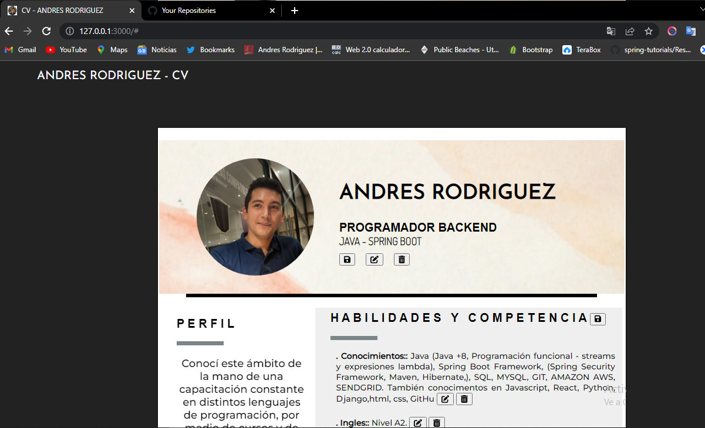

# Java - Spring Boot (Proyecto: API REST) 

## Desarrollado por 🖥️  [AndresRodriguez](https://www.linkedin.com/in/andres-rodriguez-60a166208/) - [GitHub](https://github.com/AndrRod) - [PortFolio](https://andresporfolio.herokuapp.com/)

### Objetivo

Proyecto API REST - El objeto es crear el backed de una página web que simula ser mi CV (curriculum), con la posibildiad de hacer un crud, a su vez esta api sera consumida a traves de un Front end Desarrollado con Html, css, javascipt y React.

### Herramientas utilizadas
- 👉 Java y Spring Boot
- 👉 Librería Spring Security
- 👉 Encriptación de contraseñas (PasswordEncoder)
- 👉 Utilización de tokens para validar usuario a fin de que solo el usuario registrado pueda modificar el cv.
- 👉 Manejo de Excepciones (Carpeta exception - excepciones particulares reutilizables - manejo general de excepciones)
- 👉 Manejo de Mensajes de respuestas 
- 👉 Utilización de DTOs (creación manual).
- 👉 Soft delete (borrado logico) para en el caso de que se borre el cv sin querer queden almacenados de igual manera

### FONT END VISTA PREVIA.

